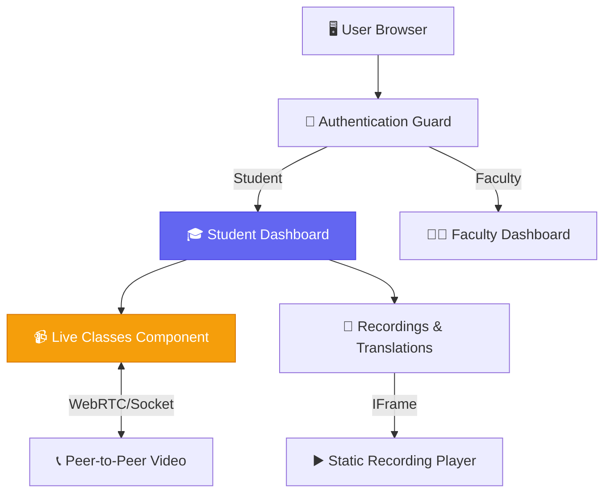

<div align="center">

# 🌌 ORBIT Frontend App

<p>
  
  
  
  
</p>

<p>
  <strong>The interactive student and faculty portal for the ORBIT platform</strong>
  <br />
  <em>Modern, responsive UI for course management, live video classes, and recorded lessons</em>
</p>

</div>

---

## ✨ Key Features

| Feature | Description |
|---------|-------------|
| 🎓 **Student Dashboard** | Track progress, access course materials, and view class recordings |
| 👨‍🏫 **Faculty Portal** | Manage courses, assignments, and schedule live sessions |
| 📹 **Live Video Classes** | Real-time interactive class environment with chat and screen sharing |
| 🎙️ **Voice Translation** | One-click localized audio translation for recorded class videos |
| 🌙 **Theme Support** | Modern, clean aesthetic with responsive design for all devices |

---

## 🏗️ Architecture & Flow



---

## 🚀 Quick Start

### Prerequisites

- **Node.js** (v18+)
- **Angular CLI** (`npm i -g @angular/cli`)
- **ORBIT Backend** running on port 5000

### 1️⃣ Installation

```bash
# Navigate to frontend directory
cd frontend/orbit

# Install dependencies
npm install
```

### 2️⃣ Development Server

```bash
# Serve the app locally (Port 4200 by default)
ng serve

# Or open in browser automatically
ng serve --open
```

Navigate to `http://localhost:4200/`. The app will automatically reload if you change any of the source files.

---

## 🛠️ Build & Deployment

```bash
# Production bundle
ng build --configuration production
```

The build artifacts will be stored in the `dist/orbit/` directory. These files can be served by any static hosting provider (Nginx, Netlify, Vercel, Firebase Hosting, etc.).

---

## 📂 Project Structure

```
frontend/orbit/src/
├── 📁 app/
│   ├── 📁 components/       # Reusable UI elements (Nav, Modals, Cards)
│   ├── 📁 pages/            # Main route views (Dashboard, Login)
│   ├── 📁 services/         # API integration & state management (Auth, Courses)
│   ├── 📁 guards/           # Route protection (AuthGuard)
│   ├── app.routes.ts        # Application routing logic
│   └── app.component.ts     # Root component
├── 📁 assets/               # Images, icons, and static files
├── 📁 environments/         # API URL configurations (Dev/Prod)
└── 📄 index.html            # Main HTML template
```

---

<div align="center">

### Built with ❤️ for ORBIT

<p>
  
  
  
</p>

</div>
